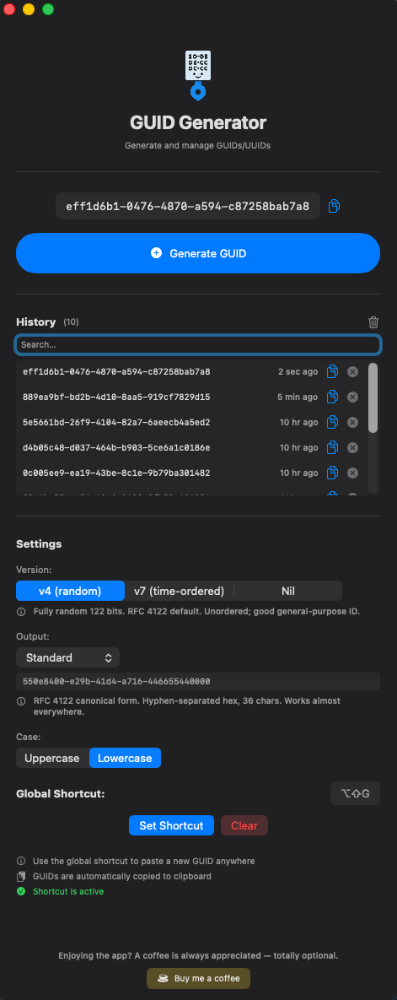

# GuidGen

Fast macOS GUID / UUID generator. Lives in your menu bar, pastes a new GUID into any focused app with a global keyboard shortcut.

## Features

  

- **Global hotkey** — press your shortcut from anywhere; a new GUID is generated and pasted into the focused application.
- **Menu bar mode** — quick generate, recent list, format/version pickers without opening the window.
- **UUID versions** — v4 (random), v7 (time-ordered, ideal as DB primary key), Nil.
- **Output formats** — `Standard`, `NoHyphens`, `{Braces}`, `(Parens)`, `Base64`, `Guid.Parse("…")` (C#), `'…'` (SQL).
- **Persistent history** — last 50 GUIDs, searchable, click to re-copy.
- **Uppercase / lowercase** toggle.

## Install

1. Download the latest `GuidGen-x.y.dmg` from [Releases](https://github.com/AGrefslie/guidgen/releases).
2. Open the DMG and drag **GuidGen.app** to `/Applications`.
3. Launch GuidGen.
4. Grant **Accessibility** permission when prompted (required for the global paste shortcut). System Settings → Privacy & Security → Accessibility → enable GuidGen.

The app is signed with a Developer ID and notarized by Apple, so Gatekeeper will accept it without warnings.

### Requirements

- macOS 13 Ventura or later.

## Usage

- Click the key icon in the menu bar → **New GUID** to copy a fresh GUID without opening the window.
- Configure a global shortcut in the main window (Settings → Global Shortcut → Set Shortcut). Press it from anywhere to paste a new GUID into the current text field.
- Pick UUID version + output format in Settings; the next generated GUID uses them.
- Browse and re-copy any of the last 50 GUIDs from the History panel.

## Support

If GuidGen saves you time, you can buy me a coffee — totally optional:

[buymeacoffee.com/axelgrefslie](https://buymeacoffee.com/axelgrefslie)

## License

Not yet decided. Until a `LICENSE` file is added, all rights reserved. Open an issue if you have a use case in mind.
